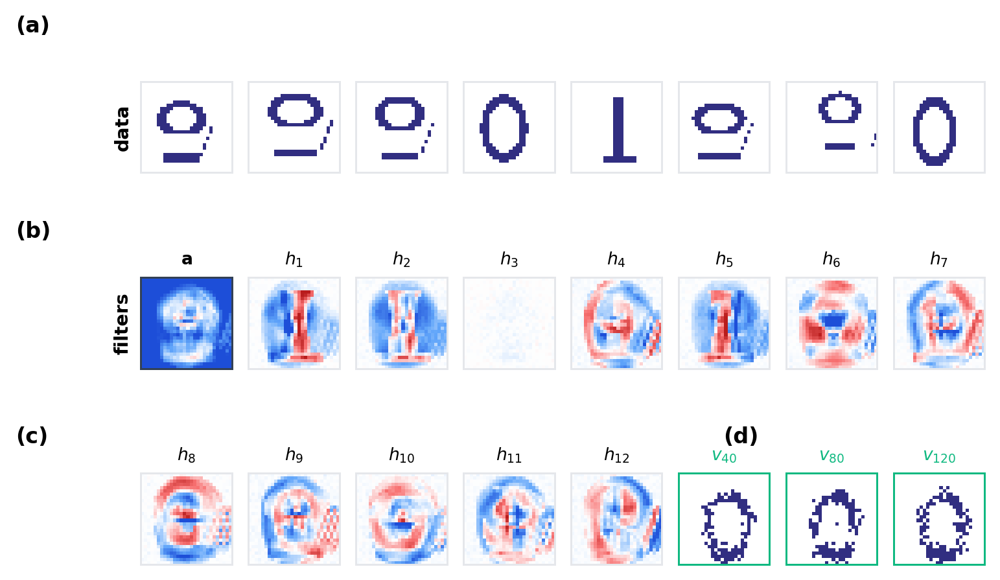
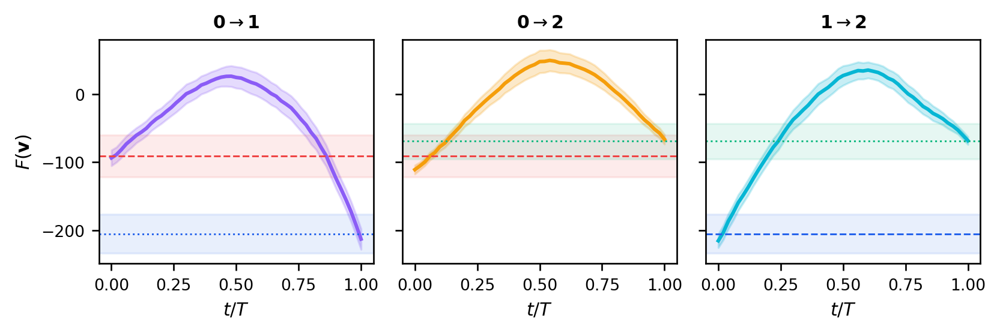
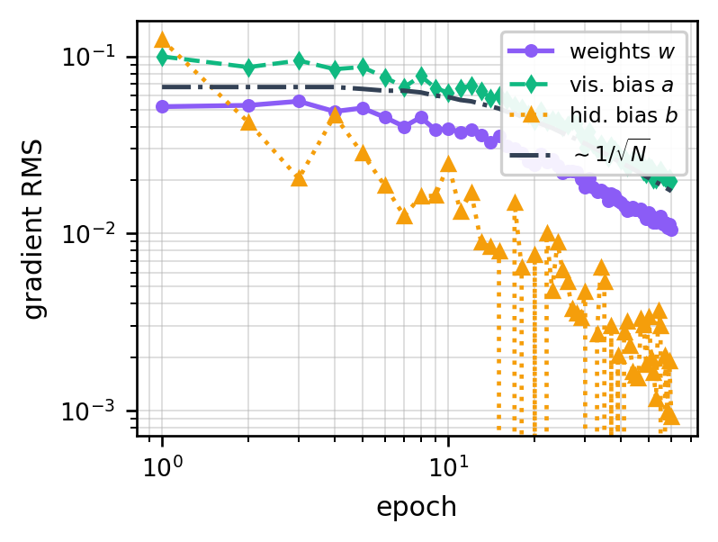

# Restricted Boltzmann Machines on MNIST

An implementation and experimental analysis of a Restricted Boltzmann Machine (RBM), covering contrastive divergence, visible-bias initialisation, Gibbs sampling, free-energy barriers, and hyperparameter sensitivity.

**Author:** Amirmohammad Saiedi Saber

[Read the four-page technical report](report/restricted_boltzmann_machine_mnist.pdf)



## Project overview

This project trains an RBM on binarised MNIST digits `{0, 1, 2}` and studies the model as both a generative neural network and a statistical-mechanics system. The implementation uses NumPy and scikit-learn, with block Gibbs sampling and Contrastive Divergence for learning.

The baseline experiment uses:

| Parameter | Value |
|---|---:|
| Visible units | 784 (`28 × 28`) |
| Hidden units | 12 Bernoulli units |
| CD depth | `CD-2` |
| Optimiser | RMSprop |
| L1 regularisation | `γ = 10⁻³` |
| Training | 150 epochs, 20 minibatches per epoch |
| Minibatch schedule | 10 → 500 examples |

## What the project demonstrates

- RBM energy, free energy, and factorised conditional probabilities.
- Contrastive Divergence with positive and negative learning phases.
- Hinton’s visible-bias initialisation from empirical pixel frequencies.
- Receptive-field visualisation for learned hidden units.
- Free-running Gibbs chains for generative sampling.
- Gradient RMS compared with the Monte Carlo `1/√N` noise floor.
- Forced pixel-flip paths between digit classes to measure energy barriers.
- A ten-configuration study of optimiser, encoding, regularisation, hidden width, and CD depth.

## Selected findings

| Experiment | Saved result |
|---|---|
| Gradient convergence | The weight-gradient RMS approaches the sampling noise floor after roughly 50 epochs. |
| Energy barriers | Mean barriers are approximately `104`, `62`, and `84` free-energy units for transitions `0→1`, `0→2`, and `1→2`. |
| Barrier signal-to-noise | Corresponding SNR values are approximately `1.8`, `1.1`, and `1.4`. |
| Gibbs-chain mixing | At most `0.6%` of sampled CD steps leave the starting class basin in the saved experiment. |
| Hidden capacity | The `L = 24` configuration gives the largest saved `1→2` barrier (`ΔF ≈ 83.2`) in the hyperparameter sweep. |
| Strong regularisation | Increasing L1 regularisation reduces the saved barrier to `ΔF ≈ 46.2`, indicating under-capacity. |

These values are empirical results for the saved random seeds, finite samples, preprocessing choices, and parameter grids; they are not universal RBM guarantees.



## Repository structure

```text
.
├── assets/                  # selected figures for GitHub and LinkedIn
├── notebooks/
│   └── restricted_boltzmann_machine_mnist.ipynb
├── report/
│   ├── restricted_boltzmann_machine_mnist.pdf
│   ├── restricted_boltzmann_machine_mnist.tex
│   └── fig_*.png            # report figures required for compilation
├── CITATION.cff
├── LICENSE
└── requirements.txt
```

## Quick start

```bash
git clone https://github.com/Amir-SaiediSaber/restricted-boltzmann-machine-mnist.git
cd restricted-boltzmann-machine-mnist
python3 -m venv .venv
source .venv/bin/activate
python -m pip install --upgrade pip
pip install -r requirements.txt
jupyter lab notebooks/restricted_boltzmann_machine_mnist.ipynb
```

The notebook downloads MNIST from OpenML on first use and caches it under `DATA/`. A full rerun is computationally intensive because the baseline and hyperparameter studies train multiple RBMs.

## Build the report

From the repository root, compile with a LaTeX installation or Tectonic:

```bash
cd report
tectonic -X compile restricted_boltzmann_machine_mnist.tex
```

The source is engine-portable and includes all five required report figures.

## Interpretation

The gradient RMS provides a practical convergence diagnostic: once it reaches the stochastic `1/√N` floor, longer training mostly follows sampling noise unless the minibatch size grows or the learning rate decreases.

The forced-transition experiments expose distinct digit basins separated by large free-energy barriers. Those barriers explain the observed quasi-ergodic behaviour: finite Gibbs chains can remain trapped in the class basin where they started even though the Markov chain is ergodic in principle.



## Limitations

- The model is trained only on MNIST digits `0`, `1`, and `2`.
- Input pixels are binarised, discarding grayscale information.
- Contrastive Divergence provides a biased approximation to the model expectation.
- Barrier estimates depend on the selected pixel-flip path and finite endpoint samples.
- The project is an experimental study, not a production image generator.

## Author

Amirmohammad Saiedi Saber — [GitHub](https://github.com/Amir-SaiediSaber) · [LinkedIn](https://www.linkedin.com/in/amir-saiedi-saber-33526b233)
